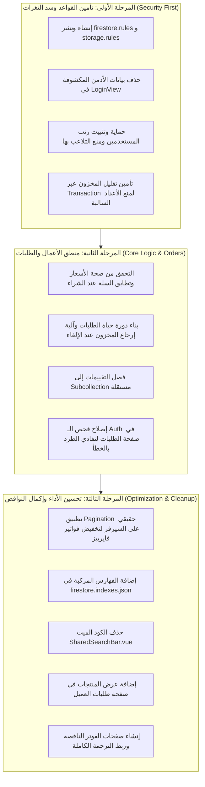

# تقرير الفحص الأمني والتقني الشامل (Full Audit Report)
**اسم المشروع:** متجر إلكتروني بنظام البائع الفردي (Single-Vendor E-Commerce)  
**التقنيات المستخدمة:** Vue 3 (Composition API), Vite, Pinia, Firebase (Firestore, Auth, Storage), Vue Router, Vee-Validate, Yup, vue-i18n.  
**تاريخ الفحص:** سبتمبر 2026  
**حالة التقرير:** تشخيصي شامل وتوثيقي قبل بدء التعديلات.

---

## فهرس التقرير
1. [نظرة عامة على المشروع ومنهجية الفحص](#1-نظرة-عامة-على-المشروع-ومنهجية-الفحص)
2. [الثغرات الأمنية الحرجة والمخاطر المباشرة (Critical Security Vulnerabilities)](#2-الثغرات-الأمنية-الحرجة-والمخاطر-المباشرة)
3. [عيوب المنطق البرمجي للعمليات وحالات الحافة (Business Logic Flaws & Edge Cases)](#3-عيوب-المنطق-البرمجي-للعمليات-وحالات-الحافة)
4. [النواقص الوظيفية والأكواد الميتة (Incomplete Features & Dead Code)](#4-النواقص-الوظيفية-والأكواد-الميتة)
5. [مشاكل الأداء والتكلفة العالية في فايربيز (Performance & Firebase Cost Hotspots)](#5-مشاكل-الأداء-والتكلفة-العالية-في-فايربيز)
6. [خريطة الطريق وخطة العمل المقترحة (Prioritized Remediation Roadmap)](#6-خريطة-الطريق-وخطة-العمل-المقترحة)

---

## 1. نظرة عامة على المشروع ومنهجية الفحص

تم إجراء مراجعة دقيقة لجميع ملفات ومكونات المشروع البرمجية سطراً بسطر بهدف تقييم جاهزية المتجر للعمل في بيئة الإنتاج الحقيقية (Production-Ready).

المشروع مبني بهيكل ممتاز من ناحية واجهة المستخدم وسلاسة التصفح والتصميم الجذاب والدعم المزدوج للغتين العربية والإنجليزية. ومع ذلك، **يعتمد المشروع بشكل شبه كلي على تنفيذ كافة العمليات الحساسة (حساب الأسعار، تقليل المخزون، التحقق من الصلاحيات، إنشاء وتعديل الوثائق) مباشرة من المتصفح (Client-Side)** دون وجود بيئة خلفية آمنة (Cloud Functions) أو قواعد حماية صارمة في فايربيز (`firestore.rules` و `storage.rules`).

هذا الاعتماد يجعل النظام عرضة للتلاعب المباشر بالأسعار والمخزون والصلاحيات وسحب كامل قواعد البيانات.

---

## 2. الثغرات الأمنية الحرجة والمخاطر المباشرة

### 2.1 غياب ملف قواعد أمان فايرستور بالكامل (`firestore.rules`)
- **الملف:** مسار المشروع الرئيسي (الملف غير موجود)
- **السبب الجذري:** لا يوجد ملف `firestore.rules` أو `firebase.json` داخل المشروع لتعريف الصلاحيات وحدود الوصول.
- **الأثر والخطورة:** إذا كانت قاعدة البيانات في وضع الاختبار (Test Mode) أو تسمح بالقراءة والكتابة العامة، فإن أي مستخدم لديه معرّف المشروع (`ecommerce-2e876`) يستطيع قراءة وتعديل وحذف كل وثائق المتجر (المنتجات، الطلبات، المستخدمين) مباشرة من المتصفح دون أي قيد.
- **الحل المقترح:** كتابة ونشر ملف `firestore.rules` يمنع الكتابة العامة للمنتجات إلا للمدير، ويمنع المستخدمين من تعديل صلاحياتهم، ويحصر استرجاع الطلبات بمالك الطلب فقط.

---

### 2.2 إتمام الشراء والتلاعب المباشر بالأسعار من المتصفح (Price Tampering)
- **الملف:** [src/views/CheckoutView.vue](file:///d:/ITI/vue-js/projects/vue-ecommerce/src/views/CheckoutView.vue)
- **الأسطر:** [L173-L200](file:///d:/ITI/vue-js/projects/vue-ecommerce/src/views/CheckoutView.vue#L173-L200)
- **السبب الجذري:** يتم إرسال بيانات السلة والإجمالي النهائي المحسوب على جهاز العميل مباشرة إلى قاعدة البيانات:
  ```javascript
  const orderData = {
    userId: currentUserId.value || 'guest',
    customer: { ...values },
    items: cartStore.cart,
    totalPrice: cartStore.totalPrice, // محسوب في الفرونت إند!
    totalItems: cartStore.totalItemsCount,
    status: 'pending',
    createdAt: serverTimestamp()
  }
  batch.set(newOrderRef, orderData)
  ```
- **الأثر والخطورة:** يستطيع أي مشتري فتح أدوات المطور (DevTools Console) وتعديل مصفوفة السلة وقيمة `cartStore.totalPrice` إلى `1` جنيه أو سنت واحد فقط وتأكيد الطلب؛ وسيتم تسجيل الطلب في قاعدة البيانات بالسعر المزور دون أن يكتشف النظام ذلك!
- **الحل المقترح:** نقل عملية إنشاء الطلب وحساب الأسعار بالكامل إلى السيرفر عبر **Firebase Cloud Functions**. يرسل العميل فقط أرقام المنتجات والكميات المطلوبة `[{ productId, quantity }]`، وتقوم الدالة بجلب الأسعار الحقيقية من قاعدة البيانات وحساب الإجمالي وإصدار الطلب.

---

### 2.3 تصعيد الصلاحيات غير الآمن (Client-Driven Privilege Escalation)
- **الملفات:** 
  - [src/views/LoginView.vue: L106-L115](file:///d:/ITI/vue-js/projects/vue-ecommerce/src/views/LoginView.vue#L106-L115)
  - [src/views/AdminUsersView.vue: L161-L195](file:///d:/ITI/vue-js/projects/vue-ecommerce/src/views/AdminUsersView.vue#L161-L195)
  - [src/router/index.js: L52-L64](file:///d:/ITI/vue-js/projects/vue-ecommerce/src/router/index.js#L52-L64)
- **السبب الجذري:** يتم تخزين رتبة المستخدم (`role: 'customer' | 'admin'`) كحقل نصي عادي في وثيقة المستخدم داخل Firestore، ويتم قراءته والاعتماد عليه في حماية الراوتر بالفرونت إند فقط.
- **الأثر والخطورة:** يستطيع أي مستخدم كتابة سطر واحد في الكونسول:
  ```javascript
  await updateDoc(doc(db, 'users', auth.currentUser.uid), { role: 'admin' })
  ```
  وبالتالي ترقية حسابه إلى مدير والوصول للوحة التحكم الكاملة والاطلاع على بيانات المستخدمين والطلبات والمنتجات.
- **الحل المقترح:** الاعتماد على **Firebase Auth Custom Claims** أو منع العميل نهائياً من تعديل حقلي `role` و `status` عبر قواعد الأمان:
  ```javascript
  allow update: if request.auth.uid == userId 
                && !request.resource.data.diff(resource.data).affectedKeys().hasAny(['role', 'status']);
  ```

---

### 2.4 تعديل المخزون والمنتجات مباشرة من المتصفح (Stock & Product Tampering)
- **الملفات:** 
  - [src/views/CheckoutView.vue: L192-L198](file:///d:/ITI/vue-js/projects/vue-ecommerce/src/views/CheckoutView.vue#L192-L198)
  - [src/stores/productstore.js: L68-L103](file:///d:/ITI/vue-js/projects/vue-ecommerce/src/stores/productstore.js#L68-L103)
- **السبب الجذري:** أثناء الشراء يقوم العميل بتعديل المخزون مباشرة عبر `batch.update(productRef, { stock: increment(-item.quantity) })`. كما أن دوال تعديل وإضافة وحذف المنتجات في `productstore.js` تستدعي Firestore من العميل مباشرة.
- **الأثر والخطورة:** لكي يتمكن العميل من إنهاء الطلب، يجب أن تمنحه قواعد فايربيز صلاحية تعديل جدول المنتجات `products`، مما يمكّن أي شخص من تعديل أسعار أو تفاصيل المنتجات أو حتى حذفها.
- **الحل المقترح:** حظر أي تعديل على المنتجات من طرف العميل العادي، وتنفيذ خصم المخزون على السيرفر أو داخل معاملة مالية محكمة للمدير فقط.

---

### 2.5 كشف بيانات دخول تجريبية للمدير في واجهة الدخول (Exposed Admin Credentials)
- **الملف:** [src/views/LoginView.vue](file:///d:/ITI/vue-js/projects/vue-ecommerce/src/views/LoginView.vue)
- **الأسطر:** [L209-L224](file:///d:/ITI/vue-js/projects/vue-ecommerce/src/views/LoginView.vue#L209-L224)
- **السبب الجذري:** وجود صناديق تجربة سريعة تملأ البريد الإلكتروني وكلمة المرور الخاصة بحساب الأدمن تلقائياً:
  ```html
  <div class="test-box" @click="email='karim@gmail.com'; password='password'">
    <span class="role">المدير (Admin)</span>
    <span>karim@gmail.com</span>
    <span>password</span>
  </div>
  ```
- **الأثر والخطورة:** أي زائر يفتح صفحة `/login` يمكنه الضغط على الصندوق وتسجيل الدخول كمدير للنظام فوراً والتحكم في المتجر.
- **الحل المقترح:** حذف هذا القسم بالكامل من الواجهة وتغيير كلمة مرور حساب الأدمن فوراً.

---

### 2.6 غياب ملف قواعد التخزين السحابي (`storage.rules`)
- **الملف:** مسار المشروع الرئيسي (الملف غير موجود)
- **السبب الجذري:** يتم استدعاء وتهيئة Firebase Storage في [src/firebase/config.js: L4, L18](file:///d:/ITI/vue-js/projects/vue-ecommerce/src/firebase/config.js#L4) بدون وضع ملف قواعد للتحكم في الملفات.
- **الأثر والخطورة:** إمكانية رفع ملفات خبيثة أو صور بأحجام عملاقة تتسبب في استهلاك سعة التخزين وحساب الفواتير العالية.
- **الحل المقترح:** إنشاء ملف `storage.rules` يقيد الرفع بالمديرين فقط، ويشترط ألا يتعدى حجم الملف 5 ميجابايت وأن يكون امتداد صورة سليم (`image/*`).

---

## 3. عيوب المنطق البرمجي للعمليات وحالات الحافة

### 3.1 إمكانية نزول المخزون للقيم السالبة (Race Conditions & Negative Stock)
- **الملف:** [src/views/CheckoutView.vue: L194-L197](file:///d:/ITI/vue-js/projects/vue-ecommerce/src/views/CheckoutView.vue#L194-L197)
- **الخلل:** يتم خصم المخزون باستخدام `writeBatch` مع دالة `increment(-qty)`. الـ Batch لا يتحقق من القيمة الحالية قبل الخصم.
- **السيناريو:** لو تبقى في المتجر قطعة واحدة من منتج، وقام مستخدمان بالضغط على "تأكيد الطلب" في نفس اللحظة، سيتم الخصم مرتين ويصبح المخزون `-1` ويتم بيع منتج غير موجود فعلياً (Over-Selling).
- **الحل:** استخدام **Firestore Transaction** (`runTransaction`) تقرأ الكمية الحالية أولاً؛ فإذا كانت أقل من الكمية المطلوبة يتم إيقاف العملية وإظهار تنبيه للعميل.

### 3.2 عدم تحديث بيانات وأسعار السلة بعد التعديل (Stale Cart Data)
- **الملف:** [src/stores/cartStore.js: L20](file:///d:/ITI/vue-js/projects/vue-ecommerce/src/stores/cartStore.js#L20)
- **الخلل:** السلة تُحفظ في `localStorage` متضمنة السعر والاسم والمخزون وقت الإضافة.
- **السيناريو:** إذا قام المدير بتعديل سعر منتج من 100 إلى 150 دولار، أو إذا نفذ المخزون تماماً، فإن العميل الذي كان قد أضاف المنتج سابقاً سيظل يراه بسعر 100 دولار ويتمكن من إتمام الطلب بالسعر القديم.
- **الحل:** حفظ معرف المنتج والكمية فقط في `localStorage`، ومزامنة السعر والمخزون الحي مع Firestore عند فتح السلة وعند صفحة الشراء.

### 3.3 غياب دورة حياة للطلب وعدم استرجاع المخزون عند الإلغاء (No Order Restocking)
- **الملف:** [src/views/AdminOrdersView.vue: L30-L49](file:///d:/ITI/vue-js/projects/vue-ecommerce/src/views/AdminOrdersView.vue#L30-L49)
- **الخلل:** الحالات المتاحة فقط هي (`pending`, `shipped`, `completed`). لا توجد حالة إلغاء `cancelled` أو استرجاع `refunded`.
- **السيناريو:** لو طلب عميل منتجات وتم خصمها من المخزون، ثم تعذر التواصل معه أو تم إلغاء الطلب، تضيع القطع من المخزون ولا توجد آلية برمجية لإعادتها إلى الـ `stock`.
- **الحل:** بناء آلة حالات للطلب (State Machine)، وإضافة كود يرجع كميات المنتجات إلى المخزون تلقائياً عند تحويل حالة الطلب إلى ملغي `cancelled`.

### 3.4 تضخم حجم وثيقة المنتج بسبب التقييمات (Unbounded Review Growth)
- **الملف:** [src/components/ReviewForm.vue: L56-L62](file:///d:/ITI/vue-js/projects/vue-ecommerce/src/components/ReviewForm.vue#L56-L62)
- **الخلل:** يتم حشر مصفوفة التعليقات بالكامل داخل وثيقة المنتج نفسها (`reviews: [...currentReviews, reviewData]`).
- **الأثر:** الحد الأقصى لحجم أي وثيقة في Firestore هو 1 ميجابايت فقط. عندما يحصل المنتج على مئات التقييمات ستتجاوز الوثيقة الحد وتتعطل تماماً عن القراءة والكتابة. بالإضافة إلى إمكانية قيام أي شخص غير مشترٍ بإضافة تقييمات غير حقيقية دون تحقق.
- **الحل:** فصل التقييمات إلى Subcollection مستقلة: `products/{id}/reviews/{reviewId}`، وحصر إضافة التقييم لمن قام بشراء المنتج بالفعل.

### 3.5 حظر الحسابات شكلي ولا يمنع الوصول الفعلي (Client-Side Banning)
- **الملف:** [src/views/LoginView.vue: L79-L90](file:///d:/ITI/vue-js/projects/vue-ecommerce/src/views/LoginView.vue#L79-L90)
- **الخلل:** التحقق من الحظر يتم فقط في دالة تسجيل الدخول `status === 'banned'`.
- **الأثر:** لو كان المستخدم مسجلاً دخوله بالفعل ولديه جلسة نشطة، أو لو استخدم الـ API مباشرة، يستطيع الاستمرار في قراءة وتعديل البيانات لأن حسابه في Firebase Auth لا يزال فعالاً وقواعد Firestore لا تطبق شرط الحظر.
- **الحل:** تعطيل المستخدم من الـ Firebase Auth عبر Admin SDK، والتحقق من شرط `status != 'banned'` في قواعد Firestore.

---

## 4. النواقص الوظيفية والأكواد الميتة

### 4.1 ملف مكرر ومهمل بحجم 400 سطر (`SharedSearchBar.vue`)
- **الملف:** [src/components/SharedSearchBar.vue](file:///d:/ITI/vue-js/projects/vue-ecommerce/src/components/SharedSearchBar.vue)
- **الملاحظة:** هذا الملف عبارة عن نسخة مكررة قديمة من [Navbar.vue](file:///d:/ITI/vue-js/projects/vue-ecommerce/src/components/Navbar.vue) (شريط تنقل كامل به سلة وبحث وحساب)، وغير مستدعى في أي مكان بالمشروع إطلاقاً.
- **الحل:** حذفه لتنظيف المشروع وتجنب تشتت المطورين.

### 4.2 غياب استعراض تفاصيل منتجات الطلب للعميل (Customer Order Details Missing)
- **الملف:** [src/views/OrdersView.vue: L63-L80](file:///d:/ITI/vue-js/projects/vue-ecommerce/src/views/OrdersView.vue#L63-L80)
- **الملاحظة:** صفحة "طلباتي" للعميل تعرض فقط رقم الطلب، التاريخ، عدد القطع، والإجمالي. العميل لا يستطيع رؤية ما هي المنتجات التي طلبها، صورها، أو عنوان الشحن الذي سجله (على عكس لوحة الأدمن التي تحتوي على Modal تفصيلي).
- **الحل:** إضافة نافذة منبثقة أو كروت قابلة للتوسيع (Accordion) تعرض محتويات الطلب بالصور والأسعار.

### 4.3 غياب بوابات الدفع الإلكتروني رغم وجود أيقوناتها
- **الملف:** [src/components/Footer.vue: L48-L54](file:///d:/ITI/vue-js/projects/vue-ecommerce/src/components/Footer.vue#L48-L54)
- **الملاحظة:** يعرض الفوتر أيقونات Visa و Mastercard و Apple Pay، بينما في الواقع نظام الدفع هو "الدفع عند الاستلام" فقط ولا يوجد أي كود أو تكامل مع بوابات دفع (مثل Stripe أو Paymob) ولا يوجد نظام Webhooks.
- **الحل:** توضيح خيارات الدفع المتاحة في صفحة الشراء، أو دمج بوابة دفع إلكترونية آمنة.

### 4.4 روابط الفوتر فارغة وغير مترجمة
- **الملف:** [src/components/Footer.vue: L29-L43](file:///d:/ITI/vue-js/projects/vue-ecommerce/src/components/Footer.vue#L29-L43)
- **الملاحظة:** روابط "من نحن"، "تواصل معنا"، "سياسة الاسترجاع"، "الأسئلة الشائعة" جميعها تشير إلى `href="#"`. كذلك نصوص الفوتر مكتوبة بالعربية بشكل ثابت ولا تستخدم ملف الترجمة [src/i18n.js](file:///d:/ITI/vue-js/projects/vue-ecommerce/src/i18n.js) الموجود بالمشروع.

---

## 5. مشاكل الأداء والتكلفة العالية في فايربيز

### 5.1 جلب كامل المجموعات دون تقسيم سيرفر (Full Collection Reads)
- **الملفات:** 
  - [src/stores/productstore.js: L18](file:///d:/ITI/vue-js/projects/vue-ecommerce/src/stores/productstore.js#L18): `getDocs(collection(db, 'products'))`
  - [src/views/AdminOrdersView.vue: L16](file:///d:/ITI/vue-js/projects/vue-ecommerce/src/views/AdminOrdersView.vue#L16): `getDocs(query(collection(db, 'orders'), ...))`
  - [src/views/AdminUsersView.vue: L95](file:///d:/ITI/vue-js/projects/vue-ecommerce/src/views/AdminUsersView.vue#L95): `getDocs(query(collection(db, 'users'), ...))`
- **الخلل والأثر المالي:** كل زيارة للصفحة الرئيسية أو لوحة الأدمن تقوم بتحميل **كامل المنتجات أو الطلبات أو المستخدمين** دفعة واحدة إلى ذاكرة المتصفح، والتقسيم للصفحات (Pagination) يتم برمجياً عبر `slice()` بالفرونت إند!
  - لو زاد عدد المنتجات إلى 2000 والطلبات إلى 10000، كل زائر يفتح الصفحة سيستهلك آلاف الـ Reads في فايربيز.
  - هذا يؤدي إلى نفاذ الباقة المجانية فوراً وتكاليف تشغيل باهظة جداً مع بطء شديد في أجهزة الموبايل.
- **الحل:** تطبيق الـ Cursor Pagination الحقيقي على مستوى Firestore باستخدام `limit()` و `startAfter()`.

### 5.2 نقص الفهرس المركب (Missing Composite Index)
- **الملف:** [src/views/OrdersView.vue: L19-L23](file:///d:/ITI/vue-js/projects/vue-ecommerce/src/views/OrdersView.vue#L19-L23)
- **الخلل:** الاستعلام التالي:
  ```javascript
  query(
    collection(db, 'orders'),
    where('userId', '==', auth.currentUser.uid),
    orderBy('createdAt', 'desc')
  )
  ```
  يتطلب وجود **Composite Index** في Firestore يجمع بين `userId` و `createdAt`. بدون إنشاء هذا الفهرس في `firestore.indexes.json` يفشل الاستعلام ويظهر خطأ في الكونسول.

### 5.3 خطأ في توقيت الـ Auth يؤدي لتسجيل خروج وهمي عند عمل Refresh
- **الملف:** [src/views/OrdersView.vue: L12-L16](file:///d:/ITI/vue-js/projects/vue-ecommerce/src/views/OrdersView.vue#L12-L16)
- **الخلل:** يتم فحص `if (!auth.currentUser)` فور تحميل المكون في `onMounted`. في فايربيز، استرجاع حالة تسجيل الدخول يأخذ بضع أجزاء من الثانية من الـ IndexedDB، فيكون `auth.currentUser` بقيمة `null` مبدئياً، فيقوم الكود بطرد المستخدم فوراً لصفحة الدخول حتى لو كان مسجلاً بالفعل!
- **الحل:** انتظار رد `onAuthStateChanged` قبل اتخاذ قرار التوجيه لصفحة تسجيل الدخول.

---

## 6. خريطة الطريق وخطة العمل المقترحة



---

> [!NOTE]
> تم إعداد هذا التقرير الشامل وحفظه كمرجع للمشروع في الملف `AUDIT_REPORT.md`. ننتظر مراجعتك وموافقتك لتحديد أي المراحل ترغب في البدء بتنفيذها أولاً.
